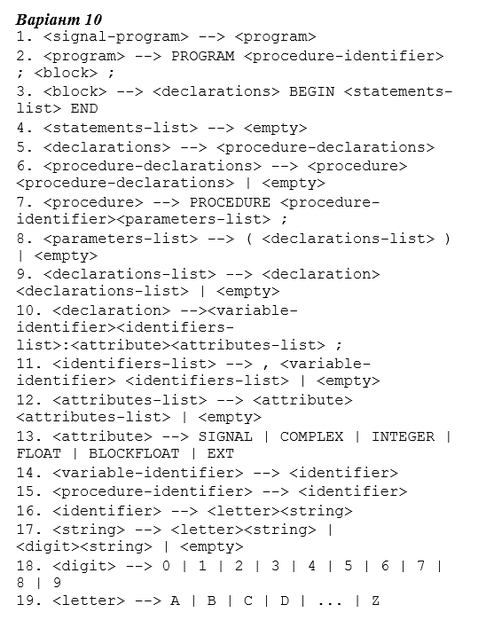

## Lab 1 Variant № 10

### Якщо не присутні синтаксичні та граматичні помилки починається граматичний аналіз та генерація коду.

### Можуть бути чотири види помилок. 

### Якщо повторюються визначення змінної в параметрі.

### Якщо використовується ім'я існуючої процедури. 

### Якщо відсутній базовий тип 

### Якщо після базового типу знаходиться не специфікатор complex

### Приклади:

### [[Generator error]: variable name [fie] repeated in [proc1] procedure declaration on [col 22] [row 3]
 
### [Generator error]: there is already a procedure with the name [proc] on [col 11] [row 3]

### [Generator error]: incorrect attribute (only 'complex' can be) in declaration on [col 34] [row 2]

### [Generator error]: declartion don`t have base type (float or integer or blockfloat) in declaration on [col 25] [row 2]

### Error: (parser) absent ':' in declaration [col:21][row:2]

### Error: (lexer) Unaccepted token '?' [col:7][row:4]